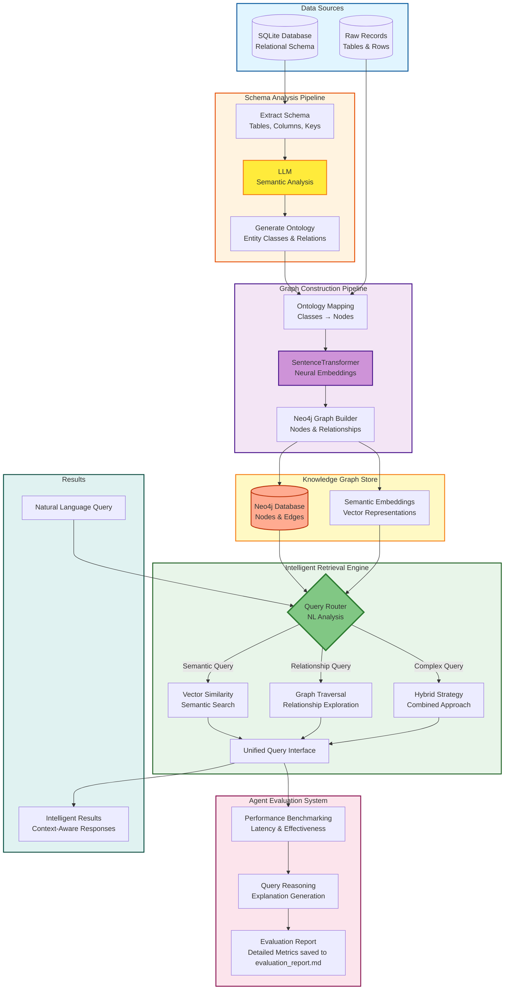

# RelGraphRAG: Relational Database to Knowledge Graph RAG System

[](https://www.python.org/downloads/)
[](https://fastapi.tiangolo.com/)


RelGraphRAG is a powerful system that automatically converts relational database schemas into semantic knowledge graphs, enabling hybrid retrieval combining vector similarity, graph traversal, and logical filtering for enhanced AI applications.

## Features

- **Multi-Database Support**: Works with PostgreSQL, MySQL, SQLite, Oracle, SQL Server, and any SQLAlchemy-compatible database
- **Automatic Schema-to-Ontology Conversion**: Uses Gemini AI to intelligently map relational schemas to semantic ontologies
- **Hybrid Retrieval Engine**: Combines vector similarity, graph traversal, and relationship reasoning
- **Real-time API**: FastAPI-based REST API for query processing
- **Performance Benchmarking**: Built-in evaluation and reporting system
- **Rich Embeddings**: Leverages sentence-transformers for semantic understanding

## Architecture

<!--  -->

## Demonstration
[View PDF containing screenshots](placeholder-for-drive-link)

## Installation

### Prerequisites
- Python 3.8+
- Neo4j 5.x running locally or remotely
- Google Gemini API key (for ontology generation)

### Setup

1. **Clone the repository**
```bash
git clone https://github.com/yourusername/RelGraphRAG.git
cd RelGraphRAG
```

2. **Create virtual environment**
```bash
# macOS/Linux
python3 -m venv .venv
source .venv/bin/activate

# Windows
python3 -m venv .venv
.venv\Scripts\activate
```

3. **Install dependencies**
```bash
pip3 install -r requirements.txt
```

4. **Configure environment variables**

Create a .env file in the project root:

```env
# Google Gemini API (for ontology generation)
GOOGLE_API_KEY=your_gemini_api_key_here

# Neo4j Configuration
NEO4J_URI=neo4j://127.0.0.1:7687
NEO4J_USER=neo4j
NEO4J_PASS=your_neo4j_password
NEO4J_DB=neo4j
```

## Quick Start

### Step 1: Generate Ontology from Schema
```bash
python3 src/schema_to_ontology.py
```
*Analyzes your database schema and generates a semantic ontology using AI*

### Step 2: Build Knowledge Graph
```bash
python3 src/transform_to_graph.py
```
*Transforms your relational data into a Neo4j knowledge graph with embeddings*

### Step 3: Start Retrieval Server
```bash
python3 src/retrieval_server.py
```
*Launches the FastAPI server on port 8000*

### Step 4: Test Queries

**Vector Similarity Search:**
```bash
curl -X POST http://127.0.0.1:8000/query \
     -H "Content-Type: application/json" \
     -d '{"query": "Find songs similar to rock music"}' | jq
```

**Graph Relationship Search:**
```bash
curl -X POST http://127.0.0.1:8000/query \
     -H "Content-Type: application/json" \
     -d '{"query": "Show tracks related to AC/DC"}' | jq
```

**Hybrid Search:**
```bash
curl -X POST http://127.0.0.1:8000/query \
     -H "Content-Type: application/json" \
     -d '{"query": "Find tracks created by artists"}' | jq
```
**Example Response for the above commands:**
```json
{
  "mode": "hybrid",
  "vector_hits": [
    {"id": "album_1", "name": "Kind of Blue", "score": 0.95}
  ],
  "graph_context": [
    {"n": {"name": "Miles Davis"}, "m": {"name": "Kind of Blue"}, "rel_types": ["CREATED"]}
  ]
}
```

### Step 5: Run Performance Evaluation
```bash
python3 src/agent_retriever.py
```
*Generates performance benchmarks and saves results to evaluation_report.md*


## Multi-Database Support

RelGraphRAG supports any database compatible with SQLAlchemy:

- **PostgreSQL**
- **MySQL**
- **SQLite**
- **Oracle**
- **SQL Server**

Simply create a directory `data` in the root of this project and upload the database file inside that directory.

## Performance Features

- **Intelligent Routing**: Automatically selects optimal retrieval strategy
- **Semantic Deduplication**: Prevents redundant similar nodes (98% threshold)
- **Relationship Pruning**: Filters semantically meaningful connections
- **Batch Processing**: Efficient embedding generation with GPU support
- **Caching**: Smart caching for frequently accessed patterns

## Use Cases

- **Enterprise Knowledge Management**: Convert internal databases into searchable knowledge graphs
- **E-commerce**: Product recommendation through relationship-aware search
- **Healthcare**: Patient data analysis with semantic understanding
- **Financial Services**: Risk analysis through entity relationship mapping
- **Research**: Academic paper and citation network analysis

## Project Structure

```
RelGraphRAG/
├── data/
│   ├── (your_database_file)
│   └── ontology.json            # Created after schema_to_ontology.py is run
├── src/
│   ├── schema_to_ontology.py    # Schema analysis & ontology generation
│   ├── transform_to_graph.py    # Graph construction with embeddings
│   ├── retrieval_server.py      # FastAPI hybrid retrieval service
│   └── agent_retriever.py       # Evaluation and benchmarking
├── data/                        # Database files and generated ontologies
├── docs/                        # Documentation and reports
├── notebooks/                   # Jupyter analysis notebooks
├── requirements.txt             # Python dependencies
└── .env                         # Environment configuration
```

## Contributing

We welcome contributions! Please see our Contributing Guidelines for details.

1. Fork the repository
2. Create a feature branch (`git checkout -b feature/amazing-feature`)
3. Commit your changes (`git commit -m 'Add amazing feature'`)
4. Push to the branch (`git push origin feature/amazing-feature`)
5. Open a Pull Request


## Acknowledgments

- [Neo4j](https://neo4j.com/) for graph database technology
- [Sentence Transformers](https://www.sbert.net/) for semantic embeddings
- [FastAPI](https://fastapi.tiangolo.com/) for high-performance API framework
- [Google Gemini](https://ai.google.dev/) for intelligent ontology generation

---